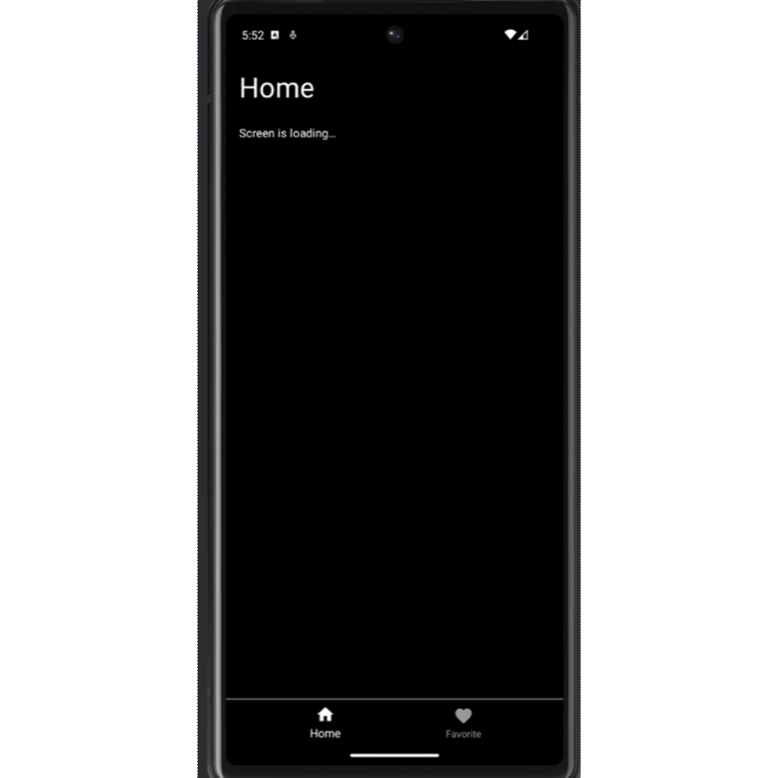
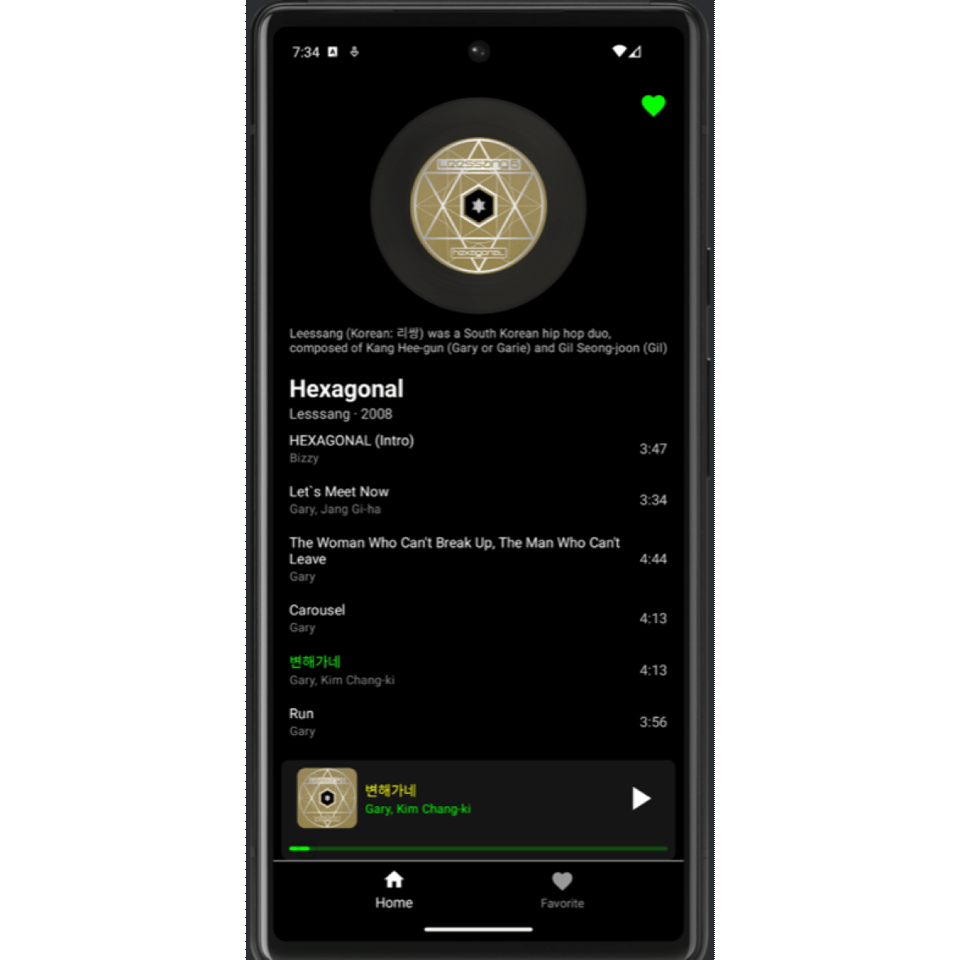

# MiniSpotify

A production-quality Android music streaming app built with **Jetpack Compose**, **MVVM architecture**, and **modern Android libraries**. Streams real audio content with a persistent global player, offline favourites via Room, and smooth navigation across Home, Playlist, and Favourite screens.

## Screenshots

| Home | Favorite |
|:----:|:---------:|
|  |  |

## Features

- **Home Feed** — Browse curated album sections fetched from a REST API, displayed in horizontally scrollable rows
- **Playlist View** — Tap any album to view its track listing with a vinyl-style cover; tap any track to start playback
- **Global Player Bar** — Persistent mini-player floats above all screens; tap to expand into a full-screen player with lyrics and a seekable progress bar
- **Favourite Albums** — Heart any album to save it locally; favourites persist offline via Room Database
- **Splash Screen** — Animated gradient splash screen with scale + fade transitions
- **Offline-First Favourites** — Room Database acts as local cache; favourite state reflects instantly without network round-trips

## Architecture
 
The app follows **Clean Architecture** with a strict **MVVM** pattern:
 
```
UI Layer (Compose)
    │   collectAsState()
    ▼
ViewModel (StateFlow / MutableStateFlow)
    │   suspend functions / Flow
    ▼
Repository (single source of truth)
    │              │
    ▼              ▼
Network (Retrofit) Local DB (Room)
```

- **UI Layer**: Jetpack Compose screens observe `StateFlow` from ViewModels via `collectAsState()`. Business logic is fully decoupled from the view.
- **ViewModel**: Exposes immutable `StateFlow<UiState>` to the UI. All state mutations go through `copy()` on data classes.
- **Repository**: Abstracts data sources. `FavoriteAlbumRepository` merges Room (offline) and `HomeRepository` fetches from the network.
- **Dependency Injection**: Hilt wires all dependencies — `ExoPlayer`, `Retrofit`, `Room`, repositories — as `@Singleton` scoped components.

## Tech Stack

| Layer | Technology |
|-------|-----------|
| **Language** | Kotlin |
| **UI** | Jetpack Compose + Material Design |
| **Architecture** | MVVM + Clean Architecture |
| **DI** | Hilt (Dagger) |
| **Networking** | Retrofit 2 + Gson |
| **Local Storage** | Room Database |
| **Audio Playback** | ExoPlayer (Media3) |
| **Image Loading** | Coil (AsyncImage) |
| **Navigation** | Jetpack Navigation Component (Fragment-based) |
| **Async** | Kotlin Coroutines + StateFlow |
 
 
## Project Structure
 
```
app/src/main/java/com/frances/spotify/
├── database/
    └── AppDatabase.kt
│   ├── DatabaseDao.kt
│   └── DatabaseModule.kt
├── datamodel/
│   ├── Album.kt
    ├── Playlist.kt
│   ├── Section.kt
│   └── Song.kt
├── network/
│   ├── NetworkApi.kt
│   └── NetworkModule.kt
├── player/
│   ├── PlayerBar.kt
│   ├── PlayerViewModel.kt
│   └── PlayerModule.kt
├── repository/
│   ├── FavoriteAlbumRepository.kt
│   ├── HomeRepository.kt
│   ├── PlaylistRepository.kt
├── splash/
│   └── SplashScreen.kt
├── ui/
│   ├── home/
│   │   ├── HomeFragment.kt
│   │   ├── HomeScreen.kt
│   │   └── HomeViewModel.kt
│   ├── playlist/
│   │   ├── PlaylistFragment.kt
│   │   ├── PlaylistScreen.kt
│   │   └── PlaylistViewModel.kt
│   └── favorite/
│       └── FavoriteFragment.kt
│       └── FavoriteScreen.kt
|       └── FavoriteViewModel.kt
├── theme/
|   ├── Color.kt
|   ├── Shape.kt
|   ├── Theme.kt
|   ├── Type.kt
├── MainActivity.kt
├── MainApplication.kt
└── SplashActivity.kt
```
 
## Getting Started
 
### Prerequisites
 
- Android Studio Flamingo or later
- JDK 8
- Android SDK 33+
- A local backend server running on port 8080

### Backend API
 
The app connects to a local server at `http://10.0.2.2:8080` (Android emulator localhost).

Required endpoints:
 
```
GET  /feed              → List<Section>   (home feed with albums)
GET  /playlist/{id}     → Playlist        (songs for an album)
```

You can spin up any mock REST server (e.g. `json-server`) with the matching response schema.
 
**Example `/feed` response:**
```json
[
  {
    "section_title": "Top Mixes",
    "albums": [
      {
        "id": 1,
        "album": "Hexagonal",
        "year": "2008",
        "cover": "https://...",
        "artists": "Lesssang",
        "description": "..."
      }
    ]
  }
]
```


### Run the App
 
1. Clone the repository
2. Start your local backend server on port 8080
3. Open the project in Android Studio
4. Run on an emulator or physical device (minSdk 23)

## Dependencies
 
```groovy
// Core
androidx.core:core-ktx:1.7.0
androidx.lifecycle:lifecycle-runtime-ktx:2.3.1
 
// Compose
androidx.compose.ui:ui:1.3.2
androidx.compose.material:material:1.2.0
androidx.activity:activity-compose:1.3.1
 
// Navigation
androidx.navigation:navigation-fragment-ktx:2.5.3
androidx.navigation:navigation-ui-ktx:2.5.3
 
// Networking
retrofit2:retrofit:2.9.0
retrofit2:converter-gson:2.9.0
 
// Image Loading
io.coil-kt:coil-compose:2.2.2
 
// Dependency Injection
dagger:hilt-android:2.44
 
// Database
androidx.room:room-runtime:2.4.3
 
// Audio
com.google.android.exoplayer:exoplayer-core:2.18.2
```


## Planned Improvements

### Core Improvements
- [ ] Replace mock server with a real cloud-hosted backend (AWS / GCP)
- [ ] Add search functionality across albums and songs
- [ ] Migrate from ExoPlayer v2 to Media3 (`androidx.media3`)
- [ ] Implement mini-player swipe-to-dismiss gesture

### Testing
- [ ] Add unit tests for ViewModels using `kotlinx-coroutines-test` and Turbine

### Production Readiness
- [ ] Implement user usage monitoring / analytics
- [ ] Add crash monitoring and post-release handling
- [ ] Implement A/B testing framework
- [ ] Handle backward compatibility for long-tail users

### Android System Design
- [ ] Add support for Service, BroadcastReceiver, and ContentProvider